# Subastral — GPU-Accelerated Bundle Adjustment & SLAM

A from-scratch GPU-accelerated Bundle Adjustment and Pose-Graph SLAM system in C++ with
CUDA. All core math (Jacobians, Schur complement, sparse Cholesky, PCG solver, LM
optimizer, loss functions, SE(3) Lie group operations) is implemented from the ground
up — no Ceres/GTSAM wrapping.

### Bundle Adjustment

| Dubrovnik (16 cameras, 22K points) |
|:---:|
| 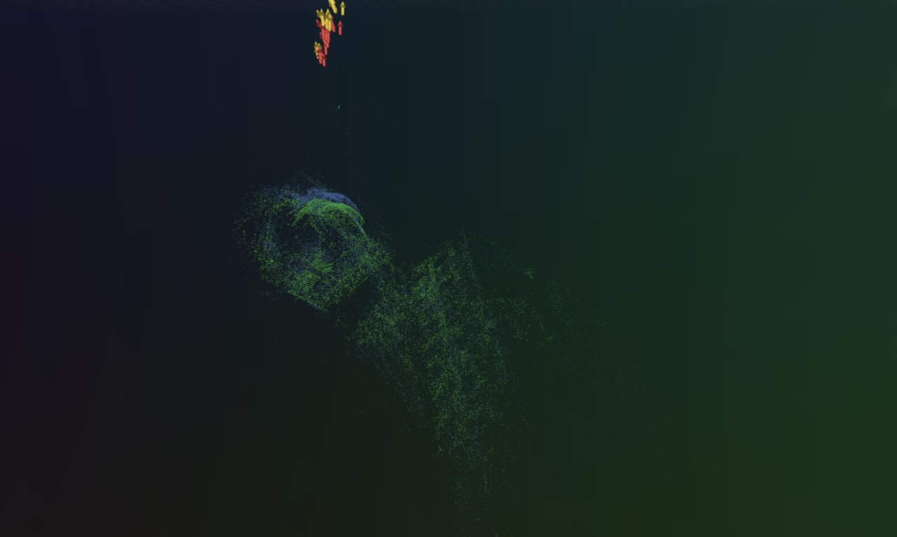 |

### Pose-Graph SLAM

Pose graph SLAM pipeline with g2o dataset.

| parking-garage | torus3D | sphere-bignoise | grid3D |
|:---:|:---:|:---:|:---:|
| 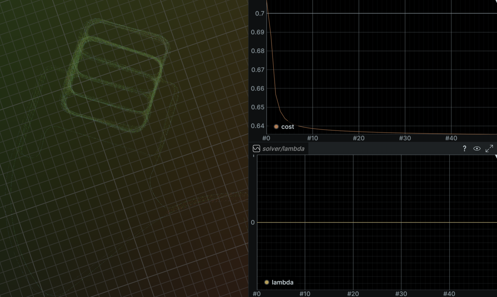 | 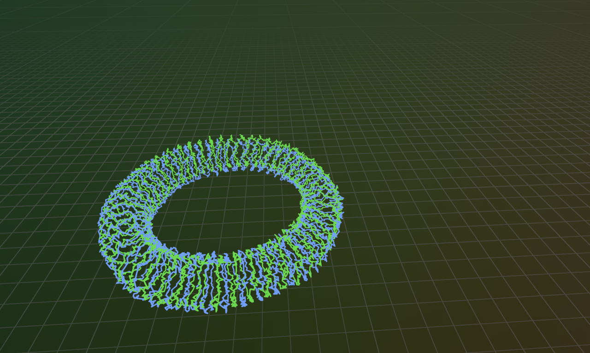 | 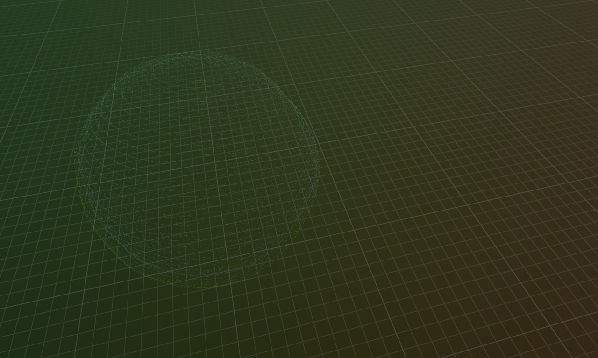 | 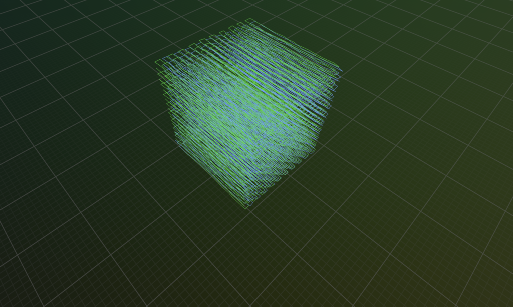 |

### Pose-Graph SLAM — Challenging Datasets (Chordal Init Required)

Odometry initialization (top) is trapped in local minima. Chordal rotation initialization
+ robust loss (bottom) produces globally consistent trajectories.

| | torus3D | sphere-bignoise | grid3D |
|---|:---:|:---:|:---:|
| **Odometry init** | 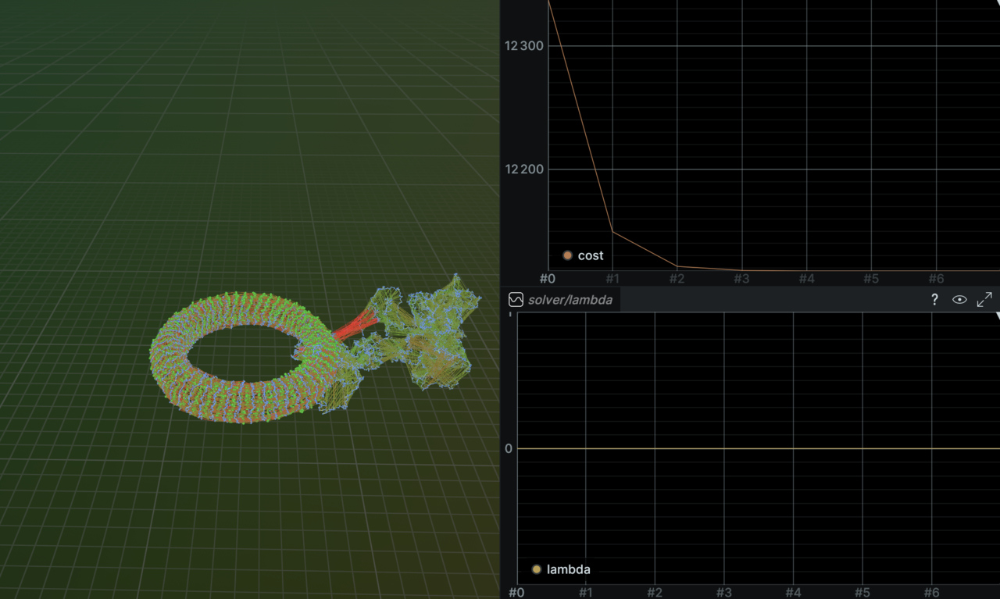 | 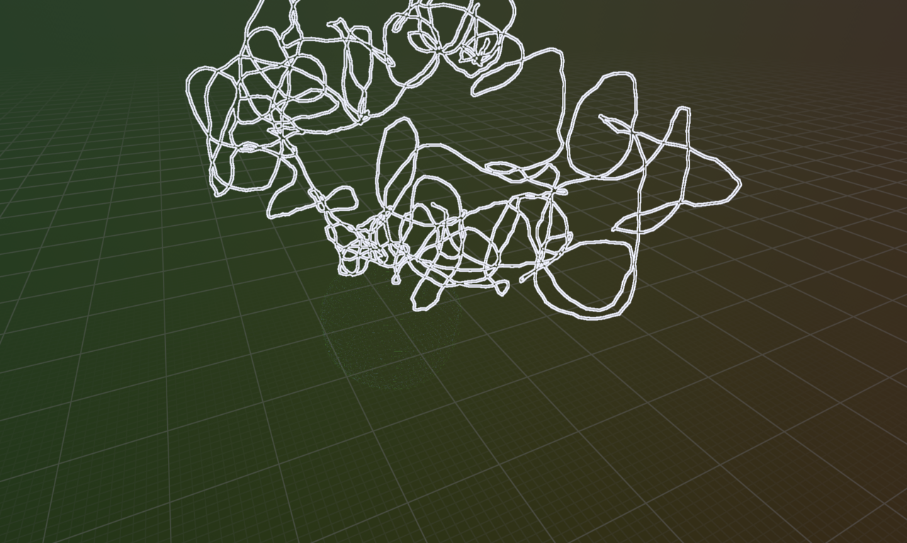 | 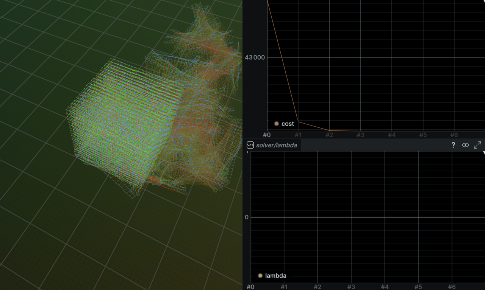 |
| **Chordal init** | 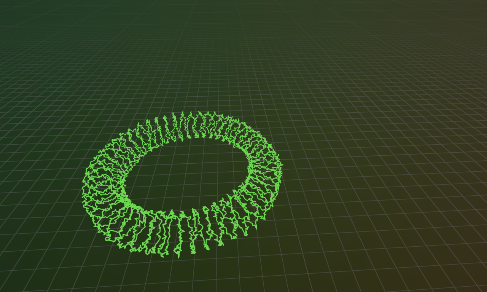 | 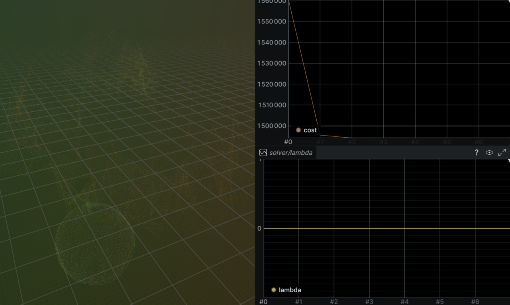 |  |

| rim (odometry init) |
|:---:|
| 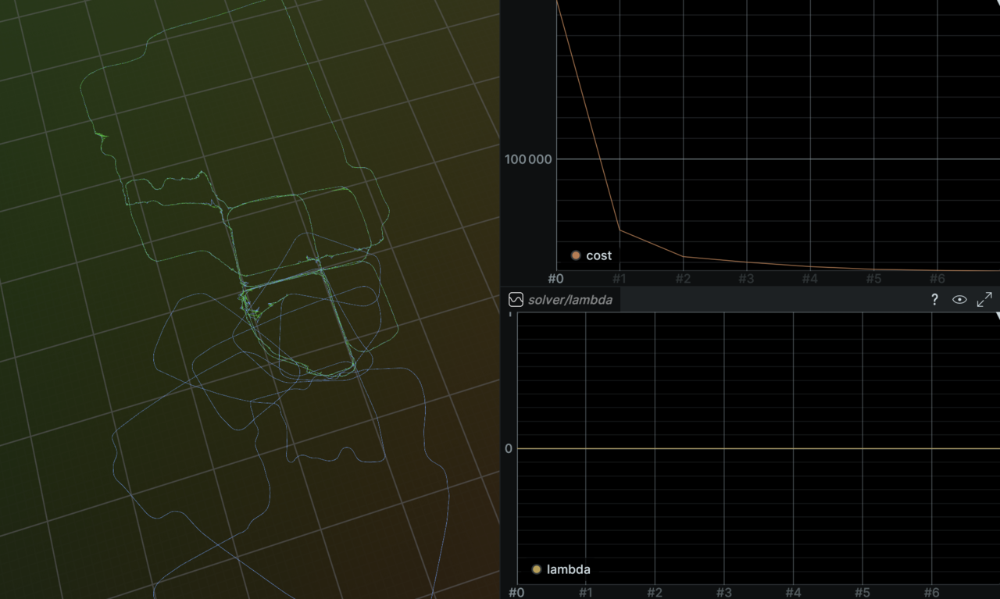 |

## Build

Requires Docker with NVIDIA CUDA 11.8 support. Uses Bazel 7.4.1 with Clang/LLD.

```bash
make build TARGET=//subastral:subastral
```

## Usage

```bash
make run TARGET=//subastral:subastral ARGS="<path_to_dataset> [options]"
```

### Options

| Flag | Description | Default |
|---|---|---|
| `--pose-graph` | Pose-Graph SLAM mode (g2o format) | off (BA mode) |
| `--chordal-init` | Pose-Graph SLAM with chordal rotation initialization | off |
| `--cpu` | Use CPU solver instead of GPU | GPU |
| `--lie` | Use SE(3) Lie group parameterization for poses | off (angle-axis) |
| `--loss <type>` | Loss function: `trivial`, `huber`, `cauchy` | `trivial` |
| `--loss-param <v>` | Loss parameter (delta for Huber, c for Cauchy) | `1.0` |
| `--pcg` | Use PCG linear solver (handles indefinite Hessians) | off (Cholesky) |
| `--pcg-max-iter <n>` | Max PCG iterations per linear solve | `500` |
| `--pcg-tol <v>` | PCG relative residual tolerance | `1e-8` |
| `--max-iter <n>` | Maximum LM iterations | `50` |
| `--lambda <v>` | Initial LM damping | `1e-3` |
| `--quiet` | Suppress per-iteration output | off |
| `--viz <path>` | Save before/after visualization PNG | off |
| `--rerun-save <p>` | Save Rerun recording to .rrd file | off |
| `--rerun-connect [addr]` | Stream to Rerun viewer via gRPC | off |

### Examples

```bash
# Bundle Adjustment — GPU solver on a BAL dataset
make run TARGET=//subastral:subastral ARGS="/data/se/bal_datasets/Dubrovnik/problem-16-22106-pre.txt --max-iter 50"

# Bundle Adjustment — CPU solver with Huber loss
make run TARGET=//subastral:subastral ARGS="/data/se/bal_datasets/Ladybug/problem-49-7776-pre.txt --cpu --loss huber --loss-param 1.0"

# Bundle Adjustment — GPU solver with SE(3) Lie group parameterization
make run TARGET=//subastral:subastral ARGS="/data/se/bal_datasets/Dubrovnik/problem-88-64298-pre.txt --lie"

# Pose-Graph SLAM — GPU solver on a g2o dataset
make run TARGET=//subastral:subastral ARGS="/data/se/g2o_datasets/parking-garage.g2o --pose-graph"

# Pose-Graph SLAM — with Rerun visualization
make run TARGET=//subastral:subastral ARGS="/data/se/g2o_datasets/torus3D.g2o --pose-graph --rerun-connect"

# Pose-Graph SLAM — PCG solver (for datasets where Cholesky fails)
make run TARGET=//subastral:subastral ARGS="/data/se/g2o_datasets/cubicle.g2o --pose-graph --pcg --lambda 1.0"

# Pose-Graph SLAM — chordal init + PCG + Cauchy robust loss (best quality)
make run TARGET=//subastral:subastral ARGS="/data/se/g2o_datasets/cubicle.g2o --chordal-init --pcg --loss cauchy --loss-param 3.0 --rerun-connect"

# Pose-Graph SLAM — chordal init + PCG (no robust loss needed for well-conditioned datasets)
make run TARGET=//subastral:subastral ARGS="/data/se/g2o_datasets/torus3D.g2o --chordal-init --pcg --rerun-connect"
```

## Tests

```bash
make test TARGET=//subastral/...
```

All 14 test targets (118 individual tests) cover:
- Analytical Jacobians: CPU finite-difference validation (6 tests) + GPU-vs-CPU consistency (3 tests)
- Lie Jacobians: CPU finite-difference validation (4 tests) + GPU-vs-CPU consistency (2 tests)
- SO(3) exp/log/hat/vee/leftJacobian: CPU (16 tests) + GPU-vs-CPU (3 tests)
- SE(3) exp/log/hat/vee/adjoint/compose: CPU (18 tests) + GPU-vs-CPU (4 tests)
- Schur complement: JtJ accumulation, Schur-vs-dense solve, symmetry (3 tests)
- LM solver: convergence, cost decrease, no-obs edge case, larger problems (7 CPU + 12 GPU tests incl. Lie)
- Pose-Graph solver: Torus3D, parking-garage, fixed-vertex (3 GPU tests)
- PCG solver: SpMV, block preconditioner, PCG convergence, vector ops, torus3D, parking-garage, cubicle, rim, fixed-vertex (9 GPU tests)
- g2o loader: file parsing, memory consistency, info matrix permutation (6 tests)
- Loss functions: Trivial, Huber, Cauchy properties (14 tests)
- Data structures: Camera, Point, Observation memory layout (4 tests)

### Code Coverage

```bash
make coverage
```

Generates an lcov HTML report at `coverage_report/index.html`. Coverage is collected
from CPU-compiled test targets only (CUDA `.cu` files compiled by nvcc do not produce
gcov data). Covered targets: common, jacobian, SO(3), SE(3), LM solver, Schur, loss
functions, g2o loader.

## CI

Uses [Buildkite](https://buildkite.com) with a self-hosted agent for GPU-accelerated
CI. The agent runs on your LAN — only outbound HTTPS connections to Buildkite's control
plane, no inbound ports exposed.

### Pipeline

The pipeline (`.buildkite/pipeline.yml`) runs on every PR:

1. **Build** — `bazel build --config=cuda //subastral/... //viz/...`
2. **Unit Tests** — `bazel test --config=cuda //subastral/... //third_party/tests/...`
3. **Code Coverage** — `bazel coverage` on CPU test targets, generates lcov HTML report

Test logs and coverage reports are uploaded as Buildkite artifacts.

### Agent Setup

To set up the Buildkite agent on your GPU machine:

```bash
# 1. Sign up at buildkite.com, create an organization, connect GitHub repo
# 2. Create a pipeline pointing to this repo, set it to read .buildkite/pipeline.yml

# 3. Install the agent (Ubuntu)
sudo sh -c 'echo deb https://apt.buildkite.com/buildkite-agent stable main > /etc/apt/sources.list.d/buildkite-agent.list'
sudo apt-key adv --keyserver hkp://keyserver.ubuntu.com:80 --recv-keys 32A37959C2FA5C3C99EFBC32A79206696452D198
sudo apt-get update && sudo apt-get install -y buildkite-agent

# 4. Configure with your agent token (from Buildkite dashboard)
sudo sed -i "s/xxx/YOUR_AGENT_TOKEN/g" /etc/buildkite-agent/buildkite-agent.cfg

# 5. Set the agent queue tag to match the pipeline
echo 'tags="queue=gpu"' | sudo tee -a /etc/buildkite-agent/buildkite-agent.cfg

# 6. Start the agent
sudo systemctl enable buildkite-agent && sudo systemctl start buildkite-agent
```

The agent needs: Docker, Docker Compose, NVIDIA Container Toolkit, and access to the
GPU. It will execute pipeline commands which use `docker compose exec` to run Bazel
inside the project's CUDA container.

## Architecture

### Phases Completed

1. **Analytical Jacobians** — Fused residual + Jacobian computation via chain rule through
   Rodrigues rotation, translation, perspective divide, and radial distortion. CPU reference
   implementation validated against central finite differences, GPU kernel validated against CPU.

2. **Schur Complement + LM Solver** — Block-sparse normal equations (U, V, W blocks),
   Schur complement point elimination to dense camera-only system, dense Cholesky solve,
   Nielsen lambda update. Full GPU pipeline: GPU Jacobians, GPU normal equation
   accumulation, GPU Schur complement formation, GPU dense Cholesky via cuSOLVER
   (`cusolverDnDpotrf` + `cusolverDnDpotrs`). When Cholesky fails (matrix not SPD at
   low damping), lambda is increased and retried entirely on GPU — no CPU fallback.

3. **Robustification** — TrivialLoss, HuberLoss, CauchyLoss with IRLS (Iteratively
   Reweighted Least Squares) weighting on both CPU and GPU.

4. **SE(3) Lie Group Infrastructure** — Full SO(3) and SE(3) exp/log maps, hat/vee
   operators, adjoint, left/right Jacobians, and their inverses. CPU reference
   implementations validated with 41 unit tests, GPU device functions validated against
   CPU. Lie-group Jacobians use left-perturbation model `T_new = Exp(delta_xi) * T_old`,
   giving simpler pose columns (`-[P_cam]x` instead of Rodrigues chain rule). Camera
   parameter update uses SE(3) composition on the pose (left-multiply by `Exp(delta_xi)`)
   with additive update on intrinsics. Integrated into the full LM solver via `--lie` flag.

5. **Pose-Graph SLAM** — Full GPU pipeline for 3D pose-graph optimization. Loads g2o
   format datasets (`VERTEX_SE3:QUAT` + `EDGE_SE3:QUAT`). Poses stored as 7 doubles
   `(x, y, z, qx, qy, qz, qw)` with Hamilton quaternion convention. Jacobians use the
   correct `J_r^{-1}` formula with SE(3) adjoint. The Hessian is assembled directly as a
   sparse CSR matrix (lower triangle only, ~half the nnz of the full matrix) and solved
   via `cusolverSpDcsrlsvchol` (GPU sparse Cholesky). Pose updates use the SE(3)
   exponential map. No Schur complement is needed for pure pose-graphs since there is no
   bipartite pose-landmark structure. Rerun visualization shows initial/optimized poses,
   edges colored by per-edge residual error, and trajectory line strips.

6. **PCG Solver** — Preconditioned Conjugate Gradient solver for the inner linear system,
   selectable via `--pcg` flag. Handles indefinite Hessians that cause sparse Cholesky to
   fail (cubicle, rim datasets). Uses a block-diagonal Jacobi preconditioner (6x6 block
   inverse per pose) and a custom symmetric SpMV kernel that operates on the existing
   lower-triangle-only CSR without doubling memory. Invalid steps (negative/NaN cost) are
   automatically rejected with lambda increase. Configurable via `LinearSolverType` enum
   in `LMConfig` — both Cholesky and PCG coexist in the same solver with zero changes to
   the CSR assembly or Hessian accumulation pipeline.

7. **Chordal Rotation Initialization** — Two-stage initialization for pose-graph
   optimization via the `--chordal-init` pipeline. Stage 1 solves for rotations by
   minimizing the chordal distance `sum ||R_ij - R_i^T R_j||_F^2` as a linear
   least-squares problem (rows of R as unknowns, unconstrained relaxation, SVD projection
   to SO(3)). Stage 2 recovers translations with rotations fixed via the linear system
   `sum ||t_j - t_i - R_i t_ij||^2`. Both stages use Eigen sparse LDLT on CPU. The
   resulting initialization is globally consistent and near-optimal — the subsequent GPU
   nonlinear refinement typically converges in under 10 iterations. This is critical for
   datasets like cubicle and rim where odometry initialization leads to local minima.

8. **Robust Loss for Pose-Graph** — Huber and Cauchy IRLS weighting wired into the
   pose-graph GPU solver. Per-edge IRLS weights are computed from the squared Mahalanobis
   distance `s = e^T Omega e` and applied to the information matrix during Hessian
   accumulation: `J^T (w_k Omega) J`. The robust cost uses `rho(s)` instead of `s`. This
   protects against outlier loop closures that would otherwise distort the trajectory.
   Combined with chordal initialization, Cauchy loss with `c=3.0` produces smooth
   trajectories on cubicle and rim with `max_odom < 0.3`.

### Parameterization

**Bundle Adjustment — Default (angle-axis):**
- Cameras: angle-axis (3) + translation (3) + focal length + k1 + k2 = **9 parameters**
- Points: X, Y, Z = **3 parameters**
- Update: additive `cam += delta`, `pt += delta`

**Bundle Adjustment — Lie group (`--lie` flag):**
- Same 9-parameter storage, but pose update uses SE(3) composition:
  1. Reconstruct `T_old = (Exp_SO3(omega), t)` from stored angle-axis + translation
  2. Compose `T_new = Exp_SE3(delta_xi) * T_old` (left perturbation, `delta_xi` is the 6D pose delta)
  3. Write back `Log_SO3(R_new)` and `t_new` to camera parameters
- Intrinsics (`f, k1, k2`) and points still use additive update
- Jacobian uses `d(P_cam)/d(delta_phi) = -[P_cam]x` (simpler than Rodrigues chain rule)

**Pose-Graph SLAM:**
- Poses: `(x, y, z, qx, qy, qz, qw)` = **7 parameters** (position + Hamilton quaternion)
- 6-DOF tangent space per pose (3 rotation + 3 translation)
- Update: `T_new = Exp_SE3(delta_xi) * T_old` (left perturbation)
- Jacobians: `dE/dxi_i = -J_r^{-1}(e) * Ad(T_j^{-1})`, `dE/dxi_j = J_r^{-1}(e) * Ad(T_j^{-1})`
- First pose is fixed (gauge freedom anchor)

### Key Design Decisions

- **Solver-local GPU state** — `common.h` stays CUDA-free; the GPU solver owns a
  `GPUSolverState` struct with `thrust::device_vector`s, uploads problem data once,
  runs the full LM loop on-GPU, syncs back at the end.
- **ODR-safe compilation** — CPU projection functions live in `.cpp` files compiled only
  by clang. GPU kernels live in `.cu` files compiled only by nvcc. CUDA-free headers
  (`.h`) alongside CUDA headers (`.cuh`) prevent ABI mismatches.
- **AVX alignment safety** — `EIGEN_MAX_ALIGN_BYTES=16` is forced globally to prevent
  alignment mismatches between clang (AVX2, 32-byte) and nvcc (SSE, 16-byte) TUs.

## Benchmark Results

Tested on BAL (Bundle Adjustment in the Large) datasets. Hardware: NVIDIA GPU (sm_75)
+ x86_64 CPU in Docker container.

### GPU with cuSOLVER (current)

Full GPU pipeline: Jacobians, normal equations, Schur complement, and dense Cholesky
solve all on GPU via cuSOLVER.

| Dataset | Cameras | Points | Observations | Wall Time | Iterations | Cost Reduction | Final RMS (px) |
|---|---|---|---|---|---|---|---|
| Ladybug-49 | 49 | 7,776 | 31,843 | **0.29s** | 4 | 86.5% | 2.68 |
| Ladybug-73 | 73 | 11,032 | 46,122 | **0.23s** | 9 | 98.2% | 0.86 |
| Ladybug-138 | 138 | 19,878 | 85,217 | **0.90s** | 22 | 97.1% | 1.21 |
| Dubrovnik-16 | 16 | 22,106 | 83,718 | **0.16s** | 16 | 99.6% | 0.66 |
| Dubrovnik-88 | 88 | 64,298 | 383,937 | **0.67s** | 9 | 99.0% | 1.24 |

### Speedup vs Previous (GPU + Eigen CPU LDLT)

Moving the dense Cholesky solve from CPU Eigen LDLT to GPU cuSOLVER eliminated the
main bottleneck for larger problems.

| Dataset | GPU+Eigen | GPU+cuSOLVER | cuSOLVER Speedup | vs CPU-only |
|---|---|---|---|---|
| Ladybug-49 | 3.3s | 0.29s | **11x** | **48x** (vs 13.8s) |
| Ladybug-73 | 9.1s | 0.23s | **40x** | **209x** (vs 48.0s) |
| Ladybug-138 | 116.9s | 0.90s | **130x** | **118x** (vs 106.5s) |
| Dubrovnik-16 | 0.4s | 0.16s | **2.5x** | **495x** (vs 79.2s) |
| Dubrovnik-88 | 51.5s | 0.67s | **77x** | — |

### GPU with Lie Group Parameterization (`--lie`)

Same accuracy as the default solver, with faster wall times due to simpler Jacobian
computation (no Rodrigues chain rule needed for pose columns).

| Dataset | Cameras | Points | Observations | Wall Time | Iterations | Cost Reduction | Final RMS (px) |
|---|---|---|---|---|---|---|---|
| Ladybug-49 | 49 | 7,776 | 31,843 | **1.59s** | 50 | 98.4% | 0.92 |
| Ladybug-73 | 73 | 11,032 | 46,122 | **0.59s** | 23 | 98.2% | 0.86 |
| Dubrovnik-88 | 88 | 64,298 | 383,937 | **5.59s** | 50 | 99.1% | 1.23 |

### Performance Characteristics

- **cuSOLVER eliminates the dense solve bottleneck.** The previous GPU pipeline was
  limited by CPU Eigen LDLT on the Schur complement. With cuSOLVER, even Ladybug-138
  (1242x1242 Schur complement) solves in under 1 second.

- **Largest speedups on medium-to-large camera counts.** Ladybug-138 went from 117s to
  0.9s (130x) because the O(n_cam^3) Cholesky now runs on GPU. Small problems like
  Dubrovnik-16 (144x144 Schur complement) see smaller gains (2.5x) since the dense
  solve was already fast.

- **Cholesky failure handling is robust.** When the Schur complement is not SPD at low
  damping (common near convergence), the solver increases lambda and retries on GPU.
  No data transfer to CPU is needed.

### Pose-Graph SLAM (GPU Sparse Cholesky)

Full GPU pipeline: per-edge residuals/Jacobians, CSR Hessian assembly, sparse Cholesky
solve via `cusolverSpDcsrlsvchol`, SE(3) pose updates — all on GPU. Tested on standard
g2o 3D pose-graph datasets.

| Dataset | Poses | Edges | Loop Closures | Initial Cost | Final Cost | Reduction | Iterations | Wall Time | Status |
|---|---|---|---|---|---|---|---|---|---|
| parking-garage | 1,661 | 6,275 | 4,615 | 8,364 | 0.634 | 99.99% | 13 | **19.1s** | Converged |
| torus3D | 5,000 | 9,048 | 4,049 | 2,400,499 | 29,958 | 98.75% | 50 | **68.9s** | Max iter |
| sphere-bignoise | 2,200 | 8,647 | 6,448 | 165,904,000 | 3,537,910 | 97.87% | 50 | **10.2s** | Max iter |
| grid3D | 8,000 | 22,236 | 14,237 | 95,303,200 | 249,040 | 99.74% | 50 | **468.6s** | Max iter |
| cubicle | 5,750 | 16,869 | 7,621 | 5,405,430 | 5,405,430 | 0.00% | 1 | 110.6s | Failed |
| rim | 10,195 | 29,743 | 13,475 | 63,831,900 | 63,831,900 | 0.00% | 1 | 220.5s | Failed |

### Pose-Graph Performance Notes (Cholesky)

- **parking-garage converges fully** to near-zero cost in 13 iterations — a well-conditioned
  dataset with dense loop closures relative to its size.

- **torus3D, sphere-bignoise, and grid3D** achieve large cost reductions (97-99%) but
  hit the max iteration limit. The cost is still decreasing slowly; more iterations or
  a preconditioned solver would help.

- **cubicle and rim fail** on the first iteration — the sparse Cholesky factorization
  (`cusolverSpDcsrlsvchol`) fails because the Hessian is not positive definite even with
  damping. These datasets have large initial noise and require either a more robust
  factorization (e.g., sparse LDL^T or iterative PCG) or a better initialization strategy.

- **Wall time is dominated by `cusolverSpDcsrlsvchol`** — the sparse Cholesky is called
  once per iteration. For grid3D (47,994 DOF, ~1.3M nnz), each solve takes ~9s. The
  kernel/assembly phases are fast by comparison.

### Pose-Graph SLAM (GPU PCG Solver — `--pcg`)

Preconditioned Conjugate Gradient solver with block-diagonal Jacobi preconditioner.
Avoids sparse factorization entirely — uses iterative matrix-vector products on the
existing lower-triangle CSR. Handles indefinite Hessians that cause Cholesky to fail.

| Dataset | Poses | Edges | Loop Closures | Initial Cost | Final Cost | Reduction | Iterations | Wall Time | Status |
|---|---|---|---|---|---|---|---|---|---|
| parking-garage | 1,661 | 6,275 | 4,615 | 8,364 | 3.12 | 99.96% | 50 | **3.8s** | Max iter |
| torus3D | 5,000 | 9,048 | 4,049 | 2,400,499 | 30,447 | 98.73% | 50 | **5.3s** | Max iter |
| sphere-bignoise | 2,200 | 8,647 | 6,448 | 165,904,000 | 3,534,330 | 97.87% | 50 | **4.6s** | Max iter |
| grid3D | 8,000 | 22,236 | 14,237 | 95,303,200 | 435,795 | 99.54% | 50 | **6.3s** | Max iter |
| cubicle | 5,750 | 16,869 | 7,621 | 5,405,430 | 0.002 | ~100% | 49 | **1.1s** | Converged |
| rim | 10,195 | 29,743 | 13,475 | 63,831,900 | 2.50 | ~100% | 50 | **3.3s** | Max iter |

### PCG vs Cholesky Comparison

| Dataset | Cholesky Cost | Cholesky Time | PCG Cost | PCG Time | PCG Speedup |
|---|---|---|---|---|---|
| parking-garage | 0.634 | 19.1s | 3.12 | 3.8s | **5.0x** |
| torus3D | 29,958 | 68.9s | 30,447 | 5.3s | **13.0x** |
| sphere-bignoise | 3,537,910 | 10.2s | 3,534,330 | 4.6s | **2.2x** |
| grid3D | 249,040 | 468.6s | 435,795 | 6.3s | **74.4x** |
| cubicle | Failed | 110.6s | 0.002 | 1.1s | **Cholesky fails** |
| rim | Failed | 220.5s | 2.50 | 3.3s | **Cholesky fails** |

### Pose-Graph Performance Notes (PCG)

- **cubicle and rim now converge** — these datasets previously failed completely with
  Cholesky because the Hessian is not positive definite. PCG handles indefinite systems
  and drives both to near-zero cost. Invalid steps (negative cost from numerical
  instability) are automatically rejected with lambda increase.

- **PCG is dramatically faster on large graphs.** grid3D goes from 468.6s (Cholesky) to
  6.3s (PCG) — a **74x speedup** — because PCG avoids the O(n^3) sparse factorization.
  Each PCG iteration is O(nnz) matrix-vector products.

- **Cholesky reaches lower final cost** on well-conditioned datasets (parking-garage:
  0.634 vs 3.12) because the direct solve is exact while PCG is iterative. For most
  applications this difference is negligible.

- **cubicle and rim need robust loss** to produce visually correct results. The PCG solver
  correctly minimizes the L2 cost, but without Huber/Cauchy loss, outlier loop closures
  distort the odometry chain. The solver finds a valid minimum where edge residuals are
  small in aggregate, but individual odometry edges are stretched to satisfy bad loop
  closures.

### Pose-Graph SLAM (Chordal Init + PCG — `--chordal-init --pcg`)

Chordal rotation initialization followed by GPU PCG optimization. The chordal init
provides a globally consistent starting point via sparse linear solves on CPU, then the
GPU nonlinear solver refines. For datasets with outlier loop closures (cubicle, rim),
Cauchy robust loss (`--loss cauchy --loss-param 3.0`) is applied directly from the
chordal initialization — no L2 pre-pass is needed since the init is already near-optimal.

| Dataset | Poses | Edges | Init Cost | Final Cost | Reduction | Iters | Init Time | Solve Time | Total | Status |
|---|---|---|---|---|---|---|---|---|---|---|
| parking-garage | 1,661 | 6,275 | 0.7 | 0.6 | 10.2% | 50 | 226ms | 18.7s | **19.0s** | Max iter |
| torus3D | 5,000 | 9,048 | 10,000 | 9,820 | 1.8% | 7 | 1.1s | 1.1s | **2.2s** | Converged |
| sphere-bignoise | 2,200 | 8,647 | 1,510,000 | 1,445,000 | 4.3% | 7 | 630ms | 555ms | **1.2s** | Converged |
| grid3D | 8,000 | 22,236 | 41,600 | 40,200 | 3.4% | 8 | 17.7s | 2.2s | **19.9s** | Converged |
| cubicle (+Cauchy) | 5,750 | 16,869 | 70,000 | 10,000 | 84.6% | 5 | 1.2s | 2.1s | **3.3s** | Converged |
| rim (+Cauchy) | 10,195 | 29,743 | 200,000 | 50,000 | 74.3% | 8 | 2.7s | 4.9s | **7.7s** | Converged |

### Chordal Init Performance Notes

- **Chordal init produces near-optimal rotations.** The init cost is within a small
  factor of the final optimized cost for all datasets. torus3D and grid3D only needed
  1.8-3.4% further cost reduction — the chordal init was already nearly converged.

- **parking-garage does not need chordal init.** This dataset has accurate odometry and
  converges well with odometry initialization + Cholesky (19.1s, cost 0.634). The
  chordal init pipeline is slower here because PCG at low lambda requires many inner
  iterations. For well-conditioned datasets, `--pose-graph` (Cholesky) is preferred.

- **cubicle and rim require both chordal init and robust loss.** Without chordal init,
  the odometry initialization is too far from the optimum and the solver gets trapped in
  local minima. Without robust loss (Cauchy), outlier loop closures pull individual poses
  out of alignment, creating visible spikes in the trajectory. The combination of chordal
  init + Cauchy (`c=3.0`) produces smooth, visually correct trajectories.

- **Robust loss should be applied directly from chordal init, not after an L2 pass.**
  Running L2 optimization first and then switching to robust loss causes cost oscillation
  near convergence and allows the L2 pass to create distortions that the robust pass
  cannot fully undo. Since the chordal init is already a good starting point, the robust
  loss can be applied from the start.

- **Cholesky still fails on cubicle even with chordal init.** The Hessian indefiniteness
  is a structural property of the cubicle dataset (the information matrices and graph
  topology make the Hessian non-SPD regardless of initialization). PCG is required.

## Project Structure

```
subastral/
  main.cpp                          CLI entry point
  pipeline.hpp                      Abstract Pipeline interface
  ba_pipeline.{hpp,cpp}             Bundle Adjustment pipeline
  pose_graph_pipeline.{hpp,cpp}     Pose-Graph SLAM pipeline
  chordal_init_pipeline.{hpp,cpp}   Chordal-initialized Pose-Graph SLAM pipeline
  subastral.{hpp,cpp}               Top-level Subastral class (factory + delegation)
  backend/
    common.h                        Umbrella header (includes graph/)
    graph/
      memory_map.h                  FactorGraphMemoryMap + stride constants
      graph_entity.h                GraphEntity abstract base class
      ba_types.h                    Camera, Point, Observation, BAProblem
      pose_graph_types.h            Pose, PoseEdge, PoseGraphProblem
      landmark_types.h              Landmark, PoseLandmarkEdge
    solver/
      lm_solver.{hpp,cpp}           CPU LM solver (BA)
      lm_solver_gpu.{cuh,cu}        GPU LM solver (BA, dense Cholesky)
      pose_graph_solver.{cuh,cu}    GPU LM solver (pose-graph, Cholesky/PCG)
      pcg_solver.{cuh,cu}           PCG linear solver (block Jacobi preconditioner)
      schur.hpp                     Schur complement elimination
      loss_function.hpp             Trivial, Huber, Cauchy loss
    ops/                            Jacobians, projection, error computation
    lie/                            SO(3) and SE(3) Lie group implementations
  loader/
    bal_loader.{h,cpp}              BAL dataset parser
    g2o_loader.{h,cpp}              g2o dataset parser (SE3:QUAT)
  viz/                              OpenCV before/after visualizer
viz/rerun/
  ba_visualizer.{hpp,cpp}           Rerun BA visualizer
  pg_visualizer.{hpp,cpp}           Rerun pose-graph visualizer
```

## Roadmap

- [x] Phase 1: Analytical Jacobians
- [x] Phase 2: Schur Complement + LM Solver
- [x] Phase 3: Robustification (Loss Functions)
- [x] cuSOLVER Integration (GPU dense Cholesky solve)
- [x] Phase 4: SE(3) Lie Group Infrastructure
- [x] Phase 5: Pose-Graph SLAM (GPU sparse Cholesky, g2o loader, Rerun visualization)
- [x] Rerun Integration (3D visualization for BA and pose-graph)
- [x] Pipeline Refactoring (Strategy pattern for BA / Pose-Graph)
- [x] Buildkite CI (self-hosted GPU agent, unit tests + code coverage on PRs)
- [x] PCG Solver — block-diagonal Jacobi preconditioned CG for indefinite Hessians; symmetric SpMV on lower-triangle CSR; cubicle/rim now converge; 74x speedup on grid3D vs Cholesky
- [x] Chordal Rotation Initialization — two-stage linear initialization (rotation estimation via chordal relaxation + translation recovery); globally consistent starting point; cubicle/rim produce visually correct trajectories
- [x] Robust Loss for Pose-Graph — Huber/Cauchy IRLS wired into pose-graph GPU solver; per-edge weights from squared Mahalanobis distance; combined with chordal init, eliminates outlier-induced trajectory spikes
- [ ] Sparse LDL^T Factorization — direct-solve alternative to PCG for non-SPD Hessians (cubicle/rim datasets)
- [ ] Landmark-Based SLAM — extend pose-graph with pose-landmark edges (types defined in `landmark_types.h`); requires Schur complement on combined pose-landmark Hessian
- [ ] 2D Pose-Graph Support — add `VERTEX_SE2`/`EDGE_SE2` g2o parsing and 3-DOF solver; many standard benchmarks (Intel, MIT, Manhattan) are 2D
- [ ] Phase 6: Visual Front-End — feature detection/matching (ORB/FAST), triangulation, PnP for going from offline optimizer to online SLAM
- [ ] IMU Preintegration — fuse IMU between keyframes (Forster et al.) for visual-inertial SLAM
- [ ] Phase 7: Incremental SLAM — online graph construction with sliding window or iSAM2-style incremental updates for real-time operation
- [ ] Phase 8: ROS Integration
- [ ] GPU Profiling & Optimization — Nsight profiling, optimize CSR assembly, reduce host-device transfers, benchmark against g2o/GTSAM
- [ ] Branch Coverage — Bazel's LcovMerger doesn't parse llvm-cov intermediate branch format (`taken`/`nottaken`); needs lcov 2.0+ or switch to LLVM native coverage (`-fprofile-instr-generate`)

---

## Appendix: Human-in-the-Loop — Where Manual Input Mattered

This project was built collaboratively between a human engineer and an AI coding agent
(Claude). This appendix documents where human domain expertise made a material difference
to correctness and design quality, vs where the AI agent's defaults were sufficient.

### Algorithmic Corrections

These are cases where the AI's initial implementation was mathematically wrong or would
have produced a solver that compiles and runs but gives incorrect results.

**1. Pose-Graph Jacobian Formula (Critical)**

The AI initially implemented:
```
dE/dxi_i = -J_l^{-1}(e) * Ad(T_j^{-1} * T_i)
dE/dxi_j =  J_l^{-1}(e)
```

The correct formula (provided by the human) is:
```
dE/dxi_i = -J_r^{-1}(e) * Ad(T_j^{-1})
dE/dxi_j =  J_r^{-1}(e) * Ad(T_j^{-1})
```

Key differences: `J_r^{-1}` not `J_l^{-1}`, and the adjoint is of `T_j^{-1}` alone
(not `T_j^{-1} * T_i`). The derivation comes from applying the BCH approximation when
converting a left perturbation to a right perturbation of the error term. Wrong Jacobians
cause the solver to either diverge or converge to an incorrect solution.

**2. CSR Matrix Format for cusolverSpDcsrlsvchol**

The human specified:
- Must use `CUSPARSE_MATRIX_TYPE_GENERAL` (not `SYMMETRIC`)
- With `reorder=0`, the solver reads only the lower triangle automatically
- With `reorder=1`, the full matrix is required (we use `reorder=0`)
- Lower-triangle-only CSR halves the nnz storage and assembly work

Getting the matrix type or reorder flag wrong would cause silent numerical errors or
crashes. These are underdocumented cuSOLVER API details that require hands-on experience.

**3. No Schur Complement for Pure Pose-Graphs**

The AI's BA solver uses the Schur complement to eliminate landmark variables (bipartite
pose-landmark structure). The human clarified that pure pose-graphs have no bipartite
structure — there are no landmarks to eliminate. The Hessian is one sparse symmetric
matrix, solved directly with sparse Cholesky. Applying a Schur complement here would
have been fundamentally wrong.

**4. g2o Information Matrix Ordering**

The human identified that g2o stores the 6x6 information matrix in (translation, rotation)
block ordering, but the solver's internal convention is (rotation, translation). The
loader must permute the rows and columns. Without this, the information matrix weights
would be applied to the wrong residual components, producing silently incorrect results.

### Design-Level Decisions

These shaped the architecture and were provided as explicit requirements.

**5. GPU-First Architecture**

The human specified "full GPU pipeline — maximum GPU utilization, GPU is the main use
case, not CPU." This shaped the entire solver: CSR assembly on GPU, sparse Cholesky on
GPU, pose updates on GPU. Without this directive, the AI would likely have built a
CPU solver with optional GPU acceleration.

**6. Pose Storage Convention**

The human specified poses as 7 doubles `(x, y, z, qx, qy, qz, qw)` — Hamilton
quaternion with w last, matching g2o convention. Quaternion convention (w-first vs w-last)
is a classic source of silent sign errors in robotics code.

**7. Rerun Visualization Design**

Multiple specific visualization decisions were human-directed:
- Each edge must be a **separate line segment** (not batched strips) with per-edge
  color and per-edge label showing the error value
- Color ramp: odometry edges blue-to-yellow, loop closure edges green-to-red
- **Sqrt normalization** for error-to-color mapping (better visual contrast than linear)
- Initial and optimized states as **separate static entities** (both visible, togglable)

Without these inputs, the AI would have likely batched all edges into one `LineStrips3D`
with uniform color — functional but far less informative for debugging.

**5. Chordal Rotation Initialization — Row vs Column Formulation (Critical)**

The AI implemented the chordal relaxation using **columns** of the rotation matrix:
```
residual = R_i[:,c] - R_ij * R_j[:,c]
```
This minimizes `||R_i - R_ij * R_j||_F^2`, which is **not** the correct chordal
relaxation. The correct formulation (identified by the human from the Carlone et al.
ICRA 2015 paper) uses **rows** of R:
```
residual_k = R_ij^T * r^k_i - r^k_j
```
which minimizes `||R_ij - R_i^T R_j||_F^2`. The difference is subtle — both are valid
Frobenius norm minimizations, but they correspond to different measurement models.
The column-based version assumes `R_ij = R_i R_j^T` while the correct model is
`R_ij = R_i^T R_j`. The AI's version produced chordal init costs 25x worse than the
paper's reported values (2,000,000 vs 80,000 for cubicle). After fixing to the
row-based formulation, parking-garage init cost dropped from 20,000 to 0.7 (matching
the paper's 1.51), confirming the fix.

**6. Chordal Init as a Separate Pipeline (Design)**

The human specified that chordal initialization should be a separate pipeline
(`ChordalInitPipeline`) rather than a flag on the existing `PoseGraphPipeline`. This
keeps the two strategies cleanly separated with independent code paths.

**7. Robust Loss: Direct Application vs Two-Pass (Critical)**

The AI initially implemented a two-pass strategy: L2 optimization first to "converge
the bulk", then robust loss to "clean up outliers". The human observed through Rerun
visualization that this caused cost oscillation near convergence and allowed the L2 pass
to create trajectory distortions that the robust pass could not undo. The human directed
switching to direct application of robust loss from the chordal initialization, which
eliminated the oscillation and produced smoother trajectories. The key insight: when the
initialization is already good (chordal init), an L2 pre-pass is counterproductive —
it introduces the very distortions that robust loss is meant to prevent.

**8. Robust Loss: Mahalanobis vs Euclidean Norm (Critical)**

The AI initially applied the IRLS weight to the raw Euclidean residual norm `||e||^2`
while computing cost as `w * e^T Omega e`. This scale mismatch caused the Cauchy loss
to either over-suppress all loop closures (making them invisible to the optimizer) or
under-suppress outliers. The human identified the issue through Rerun visualization —
the optimized trajectory looked identical to the odometry initialization, meaning loop
closures had zero effect. After reverting to the standard formulation where both weight
and cost use the squared Mahalanobis distance `s = e^T Omega e`, the robust loss
correctly down-weighted outliers while preserving good loop closures.

### Design-Level Decisions

These shaped the architecture and were provided as explicit requirements.

**9. Rotation-First Initialization Strategy (Critical)**

The human identified (from the Carlone et al. ICRA 2015 paper) that cubicle and rim
datasets require rotation-first initialization rather than robust loss alone. The AI
had been attempting to solve the problem with increasingly complex loss function
configurations (different Huber/Cauchy parameters, information-matrix weighting
schemes), none of which produced correct results. The human correctly diagnosed that
the fundamental issue was initialization quality, not loss function design — the
odometry initialization places rotations so far from the optimum that no amount of
robust loss can recover the correct solution. This is a domain-knowledge insight that
the AI could not have reached through parameter tuning alone.

### Structural Decisions

These came up during code review and refactoring sessions.

**10. Pipeline Split into Separate Files**

The AI initially placed both `BAPipeline` and `PoseGraphPipeline` in a single
`subastral.cpp`. The human rejected this and requested separate files
(`ba_pipeline.{hpp,cpp}` + `pose_graph_pipeline.{hpp,cpp}`). This gives each pipeline
independent compilation and its own minimal dependency set.

**11. Graph Types Directory**

The human suggested splitting the monolithic `common.h` (495 lines) into
`subastral/backend/graph/` with separate headers per type family. The AI designed the
internal split (5 headers + umbrella), and the human chose the backward-compatible
umbrella approach over updating all 24 consumers.

### Summary

| Category | Decision | Source | Severity if Wrong |
|---|---|---|---|
| Math | Jacobian formula (`J_r^{-1}` + adjoint) | Human | Critical — wrong convergence |
| Math | Chordal relaxation row-vs-column formulation | Human | Critical — 25x worse init quality |
| Math | Robust loss Mahalanobis vs Euclidean norm | Human | High — loss function has no effect |
| Math | Info matrix (trans,rot) to (rot,trans) permutation | Human | High — silent wrong results |
| Math | No Schur complement for pure pose-graphs | Human | High — wrong decomposition |
| Strategy | Rotation-first init for cubicle/rim (paper reference) | Human | Critical — local minima, no solution |
| Strategy | Direct robust loss from chordal init (no L2 pre-pass) | Human | Medium — cost oscillation, residual spikes |
| GPU API | CSR format: GENERAL type, reorder=0, lower-triangle | Human | High — crash or wrong results |
| Architecture | GPU-first solver design | Human | Medium — different product |
| Architecture | Chordal init as separate pipeline | Human | Low — code organization |
| Convention | Quaternion w-last (Hamilton, g2o-compatible) | Human | Medium — silent sign errors |
| Visualization | Per-edge coloring, sqrt normalization, separate entities | Human | Low — usability |
| Structure | Separate pipeline files | Human | Low — code organization |
| Structure | Graph types directory + umbrella header | Both | Low — code organization |
| Implementation | PCG solver, SpMV kernel, preconditioner, vector ops | AI | N/A — primary output |
| Implementation | Chordal init pipeline (after correct formulation given) | AI | N/A — primary output |
| Implementation | Robust loss GPU kernels, IRLS weighting integration | AI | N/A — primary output |
| Implementation | BUILD targets, test harnesses, CLI wiring | AI | N/A — primary output |

The pattern continues from earlier phases: human inputs are highest-impact on
**mathematical formulation** and **algorithmic strategy** — the chordal relaxation
row-vs-column bug and the rotation-first initialization strategy are both cases where
the AI produced code that compiled and ran but gave fundamentally wrong results. The AI
was unable to diagnose these issues through parameter tuning or debugging alone; the
human identified the root causes through domain knowledge (reading the original paper,
understanding the measurement model `R_ij = R_i^T R_j`). The AI reliably handled
**implementation volume** — once the correct formulation was specified, the PCG solver,
chordal pipeline, and robust loss integration were implemented correctly on the first
attempt.
